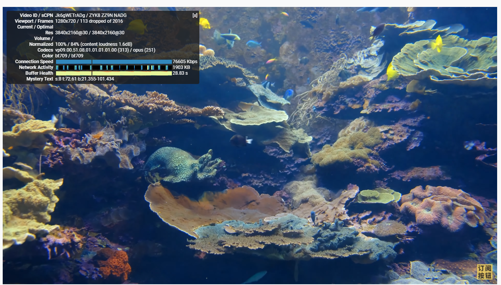
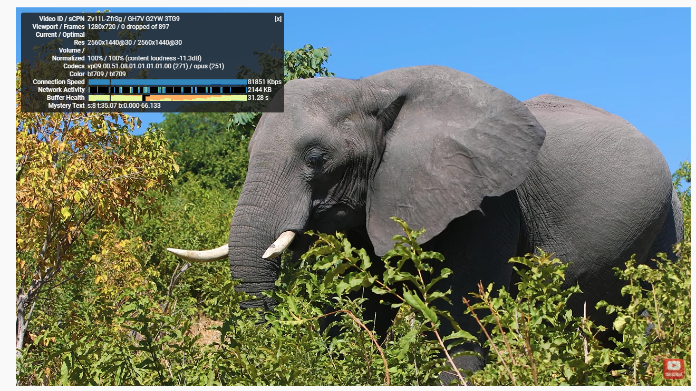
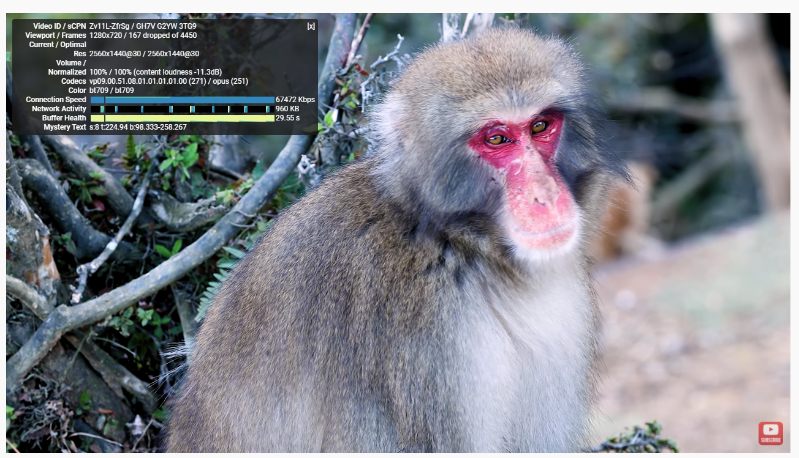

# 一篇针对windows系统的电脑梯子测评，纵享丝滑
### 本次测评只针对一款梯子的windows客户端进行，最近也听到好多朋友在问，有没有什么[好用的梯子软件](https://github.com/yourkind/bestvpn)，或者电脑梯子哪个最稳定让我推荐推荐，这种问题几乎天天可以听到，耳朵都快出老茧了。

所以今天给大家找了一个，并且进行了一次测评，看过测评的朋友，如果感觉这款梯子软件符合自己的使用情况，那么不用犹豫，可以放心使用。

## 先把梯子网址给大家贴出来：[点击进入梯子地址](https://xbsj4621.fun/i/art014)

## 一、梯子软件概况

这个梯子软件我事先登录过后台，开通好了会员账户，获得了节点权限，然后大概有这么几点概况给大家先总结一下列出来，对于没有耐心看完全文的读者，可以从总结的这几点要素当中一窥这个梯子的全貌。

1>、梯子对于新用户有三天的免费不限流试用期，所以新注册的用户可以不用着急下单开会员

2>、这个梯子软件的后台目前支持windows，ios，安卓，mac，Linux等系统的客户端下载，并且一个账号能够同时共享给多客户端使用

3>、梯子后台的线路全部都是IEPL专线，非中转，这个对于专业用户应该能看懂，线路节点质量很高

4>、后台的协议类型为Trojan和V2ray，没有ssr

5>、团队售后方式为邮件工单

情况就是这么个情况，线路节点的质量这一点给了我不小的惊喜，毕竟全部都是IEPL专线，很少有机场会下血本这么去搞，这一点比较用心了。

其次就是三天的免费试用时间，倒是给了新用户很大的避坑机会，至少不是那种先把人坑上船再宰的机场。

## 二、下载安装

因为目前手机用的是安卓，所以不想在手机上下载任何和梯子相关的软件，今天就只给大家进行电脑端的测评，不过我相信这篇测评对于绝大多数人而言应该也够用了，毕竟目前的工作娱乐，电脑的大屏还是能够提供更加畅快的体验的。

首先是客户端的下载，网站上直接有客户端下载页面，这个不用多说，选择对应的客户端下载就可以了。

我选择的是windows客户端下载，下载之后操作流程是：

解压------登录-------开启应用，三步能够搞定。

## 三、梯子使用测试

我一般在测试一款梯子软件好不好用的时候，很少会用SpeedTest网站去测，更多的是用Youtube，直接用视频去测，毕竟实战才是检验真理的唯一标准。

我自己的网络环境是：

电信宽带：100M
电脑系统：windows 10
节点选择：香港.IEPL
测试网站：Youtube
视频清晰度：4K

测试结果一：

测试结果二：

测试结果三：

三次测速我分别选择了三个不同区域的节点，总体看下来，网速相差不大，观影体验很顺畅，而且因为是4K，如果平时使用时观看1080p或者720p视频，体验会更好，目前就我自己看来，这款梯子的易用程度和稳定性还是远超我预期的。

## 四、关于这款梯子的测评总结

其实也没啥好总结的，如果你现在手头上没有一款比较好用的梯子软件的话，那么我建议你用这款，但是如果已经有了比较稳定并且使用了长久时间的机场软件，那倒是没有必要更换，将这个梯子作为备用就可以了。
